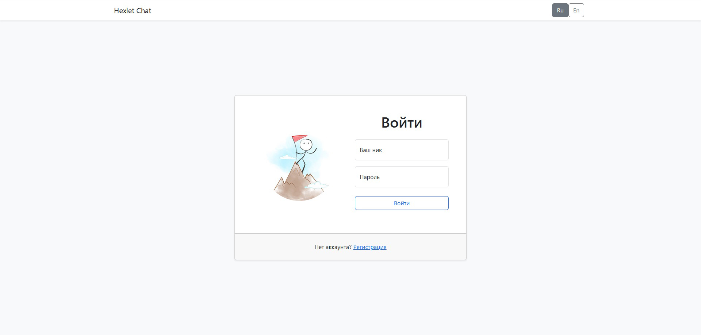
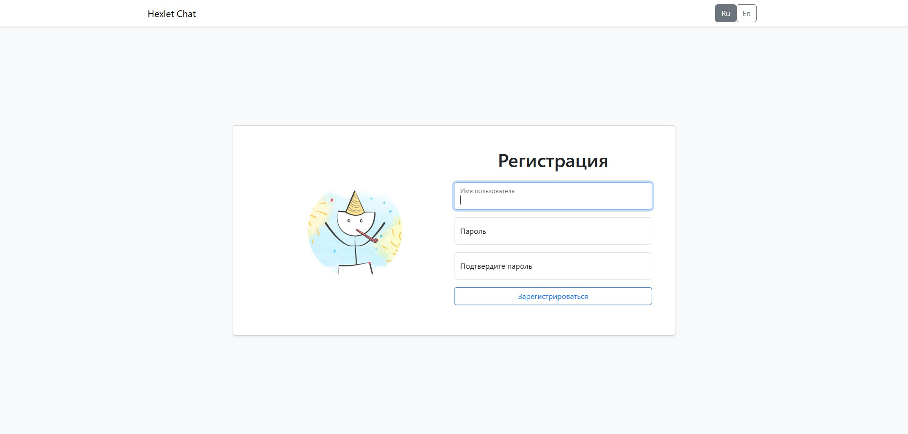
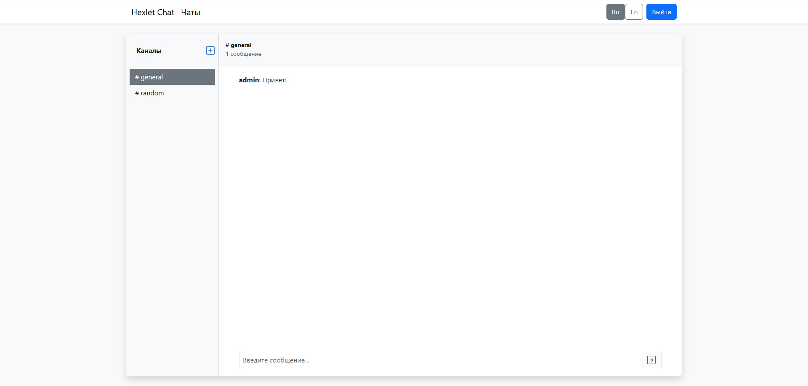
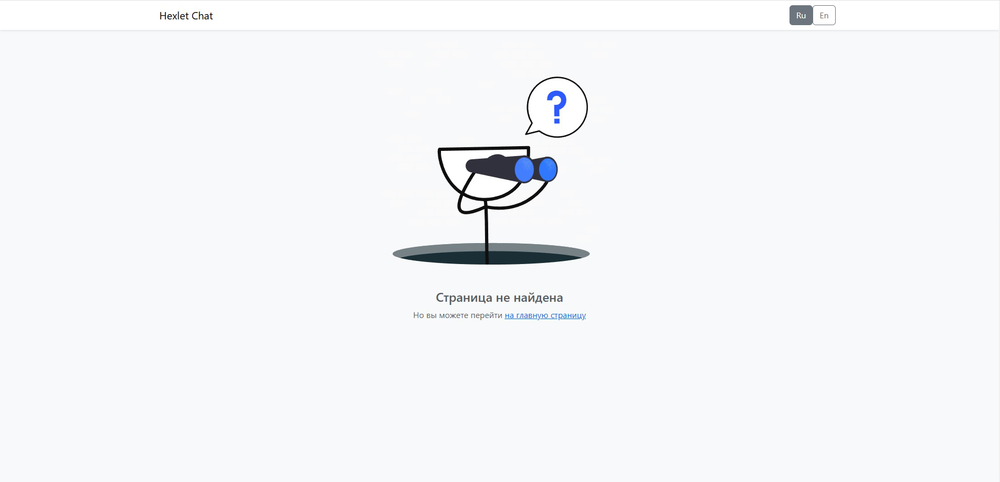

# Проект Чат (Slack)

### Hexlet tests and linter status:
[](https://github.com/Pajzer/frontend-project-12/actions)

## Описание проекта

[Hexlet Chat](https://frontend-project-pajzer.onrender.com/) — это упрощенная версия Slack-чата, предлагающая удобный интерфейс для общения. Пользователи могут создавать, редактировать и удалять каналы, а также отправлять сообщения в реальном времени с помощью веб-сокетов.

## Скриншоты

### Страница логина
Страница логина с проверкой корректности ввода.


---

### Страница регистрации
Страница для регистрации пользователя с верификацией данных.


---

### Страница чата
Страница чата с отображением списка каналов и возможностью создать свой канал.


---

### Страница 404
Страница с ошибкой, если указанный маршрут отсутствует.


---

## Установка и запуск проекта

1. Скопировать репозиторий:

```sh
git clone https://github.com/pajzer/frontend-project-12.git
```

2. Установить зависимости:
```sh
make install
```

3. Сборка проекта:
```sh
make build
```

4. Запуск проекта:
```sh
make start
```